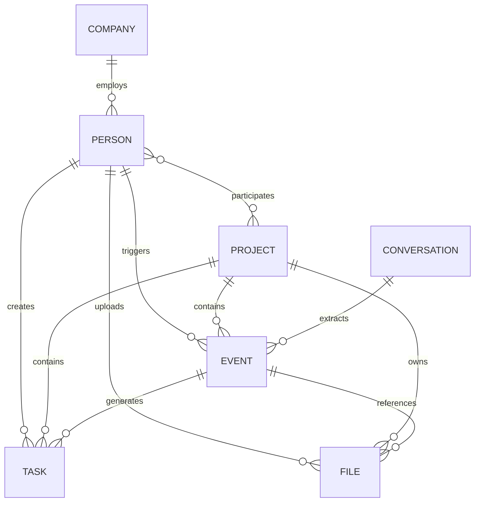

# 01-核心实体模型.md

> 团队大脑 Agent 系统
>
> 文档版本：V1.0
>
> 最后更新：2026-06
>
> 状态：架构基线文档

***

# 1. 文档目标

本文档用于定义团队大脑系统中的核心业务实体（Entity）。

其作用包括：

- 统一系统业务对象定义
- 指导数据库设计
- 指导知识图谱设计
- 指导 Agent 数据访问规范
- 指导业务流引擎设计
- 指导权限模型设计

本文档属于整个系统的数据建模基础。

后续所有业务模块均应建立在本实体模型之上。

***

# 2. 系统设计思想

## 2.1 Entity + Event 架构

系统采用：

```text
Entity + Event
```

模式。

其中：

```text
Entity
负责描述世界当前状态

Event
负责记录世界发生过什么
```

例如：

```text
张三
属于 Entity

上传图纸
属于 Event

施工许可证取得
属于 Event

未来城项目
属于 Entity
```

***

## 2.2 实体长期存在

实体具有持续生命周期。

例如：

```text
人员
项目
组织
文件
任务
```

这些对象不会因为一次业务活动结束而消失。

***

## 2.3 事件持续产生

业务过程中的变化以事件形式记录。

例如：

```text
会议召开

图纸上传

任务创建

任务完成

合同签订

许可证取得
```

这些都属于事件。

***

## 2.4 所有数据必须归属实体

任何新增数据必须能够回答：

```text
属于谁？

属于哪个项目？

由谁创建？

关联什么资料？
```

否则禁止入库。

***

# 3. 核心实体总览

系统定义七类一级实体。

```text
Person
Company
Project
Task
File
Conversation
Event
```

关系如下：

```text
Person
  │
  ├────参与────→ Project
  │
  ├────创建────→ Task
  │
  ├────上传────→ File
  │
  └────触发────→ Event

Project
  │
  ├────包含────→ Task
  ├────包含────→ Event
  └────关联────→ File

Conversation
  │
  └────抽取────→ Event

Event
  │
  ├────关联────→ File
  └────产生────→ Task
```

***

# 4. Person（人员实体）

## 4.1 定义

人员实体表示系统中的自然人。

包括：

- 企业员工
- 项目负责人
- 设计单位人员
- 施工单位人员
- 监理人员
- 供应商联系人
- 政府联系人
- 外部顾问

***

## 4.2 业务意义

人员是：

```text
业务发起者

业务执行者

业务审批者

业务责任人
```

***

## 4.3 核心属性

| 字段           | 类型       | 说明   |
| ------------ | -------- | ---- |
| id           | string   | 唯一ID |
| name         | string   | 姓名   |
| mobile       | string   | 手机号  |
| email        | string   | 邮箱   |
| department   | string   | 部门   |
| position     | string   | 岗位   |
| company\_id  | string   | 所属组织 |
| status       | string   | 状态   |
| create\_time | datetime | 创建时间 |

***

## 4.4 状态定义

```text
active
在职

inactive
停用

left
离职
```

***

## 4.5 示例

```yaml
id: PERSON-001

name: 张三

department: 景观设计中心

position: 设计经理
```

***

# 5. Company（组织实体）

## 5.1 定义

表示参与项目活动的组织机构。

***

## 5.2 类型

```text
开发商

设计院

施工单位

监理单位

供应商

咨询机构

政府部门

物业公司
```

***

## 5.3 核心属性

| 字段              | 类型     |
| --------------- | ------ |
| id              | string |
| name            | string |
| type            | string |
| address         | string |
| contact\_person | string |
| phone           | string |
| remark          | string |

***

## 5.4 示例

```yaml
id: COMPANY-001

name: XX地产集团

type: developer
```

***

# 6. Project（项目实体）

## 6.1 定义

项目是业务活动的核心容器。

所有业务活动最终必须归属于项目。

***

## 6.2 项目类型

```text
住宅项目

商业项目

产业园项目

市政项目

文旅项目
```

***

## 6.3 核心属性

| 字段          | 类型     |
| ----------- | ------ |
| id          | string |
| code        | string |
| name        | string |
| location    | string |
| stage       | string |
| status      | string |
| start\_date | date   |
| end\_date   | date   |

***

## 6.4 生命周期

```text
立项

规划

设计

报建

施工

验收

交付

运营
```

***

## 6.5 示例

```yaml
id: PROJECT-001

name: 长沙未来城

stage: construction
```

***

# 7. Task（任务实体）

## 7.1 定义

任务表示需要被执行、跟踪和关闭的工作项。

***

## 7.2 任务来源

任务可以来自：

```text
人工创建

会议纪要

事件触发

Agent自动生成

业务流程自动生成
```

***

## 7.3 核心属性

| 字段          | 类型       |
| ----------- | -------- |
| id          | string   |
| title       | string   |
| description | text     |
| project\_id | string   |
| creator\_id | string   |
| owner\_id   | string   |
| priority    | string   |
| status      | string   |
| deadline    | datetime |

***

## 7.4 状态

```text
todo

doing

waiting

completed

closed
```

***

## 7.5 优先级

```text
P0

P1

P2

P3
```

***

# 8. File（文件实体）

## 8.1 定义

文件实体用于描述系统中的资料对象。

***

## 8.2 文件类型

```text
图纸

照片

视频

录音

合同

会议纪要

制度文件

审批文件

技术标准

报告
```

***

## 8.3 存储原则

文件实体仅保存元数据。

实际文件存储于：

```text
MinIO
NAS
对象存储
```

***

## 8.4 核心属性

| 字段           | 类型       |
| ------------ | -------- |
| id           | string   |
| name         | string   |
| type         | string   |
| path         | string   |
| size         | int      |
| version      | string   |
| creator\_id  | string   |
| upload\_time | datetime |

***

## 8.5 示例

```yaml
name: 景观施工图V3.pdf

version: v3
```

***

# 9. Conversation（会话实体）

## 9.1 定义

记录人与系统之间的交互。

***

## 9.2 来源

```text
QQ

微信群

企业微信

飞书

网页端

APP
```

***

## 9.3 业务意义

Conversation是业务事件的重要来源。

Agent将持续从会话中提取：

```text
任务

项目动态

会议纪要

风险事项

知识沉淀
```

***

## 9.4 核心属性

| 字段           | 类型       |
| ------------ | -------- |
| id           | string   |
| source       | string   |
| sender\_id   | string   |
| content      | text     |
| create\_time | datetime |

***

# 10. Event（事件实体）

## 10.1 定义

事件是整个系统最重要的实体。

所有业务变化最终都表现为事件。

***

## 10.2 为什么以事件为中心

例如：

```text
上传图纸

召开会议

许可证取得

材料进场

样板验收

问题整改
```

本质都是：

```text
某个时间

某个人

在某个项目

发生了一件事情
```

因此统一抽象为 Event。

***

## 10.3 核心属性

| 字段          | 类型       |
| ----------- | -------- |
| id          | string   |
| event\_type | string   |
| title       | string   |
| description | text     |
| project\_id | string   |
| creator\_id | string   |
| status      | string   |
| occur\_time | datetime |

***

## 10.4 一级事件分类

```text
PersonEvent

ProjectEvent

TaskEvent

FileEvent

MeetingEvent

ApprovalEvent

ConstructionEvent

RiskEvent
```

***

## 10.5 示例

```yaml
event_type: drawing_upload

title: 上传景观施工图V3
```

***

# 11. 实体关系模型

## 11.1 Mermaid关系图



***

# 12. Neo4j映射规范

## 节点

```text
Person

Company

Project

Task

File

Conversation

Event
```

***

## 边

```text
PARTICIPATES_IN

CREATES

UPLOADS

TRIGGERS

BELONGS_TO

GENERATES

REFERENCES

EXTRACTS
```

***

# 13. PostgreSQL映射规范

推荐表结构：

```text
person

company

project

task

file

conversation

event
```

关系表：

```text
project_member

event_file

event_task

person_company
```

***

# 14. 设计结论

团队大脑系统的核心世界模型如下：

```text
Person
     ↓

Project
     ↓

Event
     ↓

Task
     ↓

File
```

其中：

Entity负责存储状态。

Event负责记录变化。

Task负责推动执行。

File负责保存证据。

Project负责组织业务。

Person负责驱动业务。

后续所有Agent、数据库、知识图谱、业务流引擎均建立在此模型之上。

```
```

