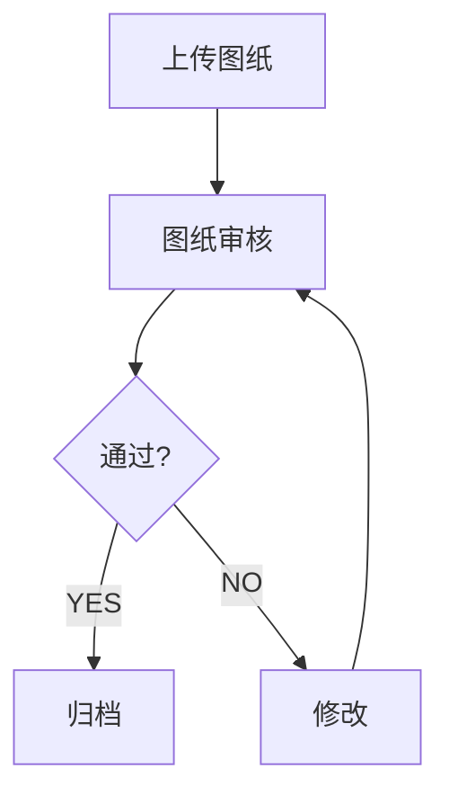

# 07-业务流引擎设计.md

> 团队大脑 Agent 系统
>
> 文档版本：V1.0
>
> 最后更新：2026-06
>
> 状态：架构基线文档

---

# 1. 文档目标

本文档定义系统业务流（Workflow）模型。

用于解决：

* 业务流程如何定义
* 流程如何执行
* Agent如何协作
* 流程如何扩展
* 流程如何沉淀为企业资产

---

# 2. 什么是Workflow

Workflow表示：

```text
一件事情应该如何被处理
```

例如：

```text
施工图上传
```

并不是一个事件结束。

而是：

上传

↓

审核

↓

修改

↓

通过

↓

归档

````

整个过程。

---

# 3. Workflow定位

系统模型：

```text
Entity

↓

Event

↓

Workflow

↓

Agent

↓

Knowledge
````

---

职责：

| 组件        | 职责   |
| --------- | ---- |
| Entity    | 记录状态 |
| Event     | 记录变化 |
| Workflow  | 组织流程 |
| Agent     | 执行动作 |
| Knowledge | 沉淀经验 |

---

# 4. Workflow核心原则

系统采用：

```text
Workflow Definition
+
Workflow Runtime
```

模式。

---

即：

```text
流程定义
```

与

```text
流程执行
```

彻底分离。

---

# 5. 为什么不能直接写LangGraph

很多项目：

```python
graph.add_node()
graph.add_edge()
```

直接写流程。

---

问题：

```text
流程变更需要改代码

业务人员无法参与

流程无法沉淀
```

---

因此禁止：

```text
业务流程硬编码
```

---

# 6. 双层架构

系统采用：

```text
Workflow Definition
(JSON)

↓

Workflow Runtime
(LangGraph)
```

---

解释：

业务人员维护：

```text
JSON
```

---

程序负责：

```text
LangGraph执行
```

---

# 7. Workflow实体

Workflow本身也是实体。

---

核心字段：

```yaml
id:
name:
version:
status:
description:
```

---

示例：

```yaml
id: WF-DRAWING-001

name: 施工图审核流程

version: 1.0
```

---

# 8. Workflow结构

统一模型：

```text
Node

+

Edge

+

Rule
```

---

即：

```text
节点

连接

规则
```

---

# 9. Node定义

Node表示：

```text
流程中的一个步骤
```

---

例如：

```text
上传图纸

图纸审核

设计修改

归档
```

---

# 10. Node类型

系统定义：

```text
StartNode

AgentNode

HumanNode

DecisionNode

EndNode
```

---

# 11. StartNode

流程入口。

---

例如：

```text
drawing_upload
```

事件。

---

触发流程启动。

---

# 12. AgentNode

由Agent执行。

---

例如：

```text
MeetingAgent

DesignAgent

ArchiveAgent
```

---

# 13. HumanNode

必须人工参与。

---

例如：

```text
设计总监审批

付款审批

合同确认
```

---

# 14. DecisionNode

决策节点。

---

例如：

```text
审核是否通过
```

---

输出：

```text
YES

NO
```

---

# 15. EndNode

流程结束。

---

例如：

```text
归档完成
```

---

# 16. Edge定义

Edge表示：

```text
下一步去哪
```

---

例如：

```text
审核通过

↓

归档
```

---

# 17. Rule定义

Rule表示：

```text
什么时候允许走这条边
```

---

例如：

```json
{
  "field":"score",
  "operator":">=",
  "value":80
}
```

---

# 18. 标准JSON结构

```json
{
  "workflow":"drawing_review",

  "nodes":[
  ],

  "edges":[
  ],

  "rules":[
  ]
}
```

---

# 19. 施工图审核流程示例

```text
上传图纸

↓

审核

↓

通过?
```

---

通过：

```text
归档
```

---

不通过：

```text
设计修改
```

---

再次审核。

---

# 20. Mermaid表示



---

# 21. Workflow状态

每个流程实例拥有状态。

---

```text
Created

Running

Waiting

Completed

Failed

Cancelled
```

---

# 22. Workflow Instance

定义：

```text
流程模板
```

与

```text
流程实例
```

分离。

---

例如：

模板：

```text
施工图审核流程
```

---

实例：

```text
未来城项目

2026-06-01

施工图审核
```

---

# 23. Workflow与Event关系

原则：

```text
Event启动Workflow
```

---

例如：

```text
drawing_upload
```

事件。

---

触发：

```text
施工图审核流程
```

---

# 24. Workflow与Agent关系

原则：

```text
Workflow负责组织

Agent负责执行
```

---

即：

Workflow回答：

```text
下一步去哪
```

---

Agent回答：

```text
这一步怎么做
```

---

# 25. Workflow与状态机关系

重要原则：

```text
Workflow

≠

State Machine
```

---

Workflow：

```text
处理流程
```

---

State Machine：

```text
状态约束
```

---

例如：

```text
审核
```

是流程。

---

```text
draft

reviewing

approved
```

是状态。

---

# 26. Runtime架构

执行层：

```text
Workflow Runtime
```

---

推荐：

```text
LangGraph
```

---

职责：

```text
加载流程

执行节点

处理状态

记录日志
```

---

# 27. Runtime执行过程

```text
读取Workflow

↓

构建Graph

↓

执行Node

↓

判断Rule

↓

选择Edge

↓

执行下一Node
```

---

# 28. Agent节点执行

例如：

```yaml
node:
    review_drawing

agent:
    DesignAgent
```

---

Runtime：

```text
调用DesignAgent
```

---

获得结果。

---

继续流程。

---

# 29. 人工节点执行

例如：

```yaml
node:
    director_approval

type:
    HumanNode
```

---

Runtime：

```text
暂停流程
```

---

等待：

```text
人工确认
```

---

继续执行。

---

# 30. 决策节点执行

例如：

```yaml
condition:
    review_score >= 80
```

---

自动选择：

```text
YES
```

或：

```text
NO
```

路径。

---

# 31. 流程日志

所有节点执行记录。

---

结构：

```yaml
workflow_id:
instance_id:
node:
executor:
result:
time:
```

---

形成：

```text
Workflow Log
```

---

# 32. 流程版本管理

流程允许升级。

---

例如：

```text
V1

V2

V3
```

---

历史实例：

```text
继续使用旧版本
```

---

新实例：

```text
使用新版本
```

---

# 33. 企业知识沉淀

最终：

```text
大量流程实例
```

形成：

```text
企业最佳实践
```

---

例如：

统计：

```text
最优审批路径

最优整改路径

最优验收路径
```

---

沉淀：

```text
标准流程
```

---

# 34. 流程自动演化

未来：

Archive Agent分析：

```text
过去100个项目
```

---

发现：

```text
某步骤总被跳过
```

---

提出：

```text
流程优化建议
```

---

人工审核后升级。

---

# 35. Workflow数据库结构

建议：

```text
workflow_definition

workflow_node

workflow_edge

workflow_instance

workflow_log
```

---

# 36. Workflow图谱关系

Neo4j：

```text
Workflow

↓

HAS_NODE

↓

Node
```

---

```text
Node

↓

NEXT

↓

Node
```

---

形成流程网络。

---

# 37. V1推荐流程

优先实现：

```text
施工图审核

会议纪要处理

问题整改

资料归档
```

---

# 38. V2扩展流程

新增：

```text
付款审批

招采流程

变更审批

报建流程
```

---

# 39. 系统运行全景

```text
Event

↓

Workflow

↓

Node

↓

Agent

↓

Result

↓

Knowledge
```

---

# 40. 设计结论

系统采用：

```text
Workflow Definition

+

Workflow Runtime
```

架构。

其中：

```text
JSON
```

定义业务流程。

---

```text
LangGraph
```

执行业务流程。

---

实现：

```text
业务人员可配置

程序负责执行

流程持续沉淀

经验持续演化
```

最终形成企业级业务操作系统。
