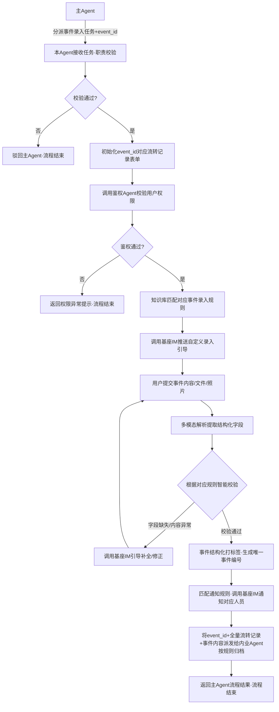

# 业务流：通用业务事件录入
**适配业务**：全场景项目相关事件录入，包括但不限于：施工日报/周报上报、各类证件获取（施工许可证/规划证等）、重要领导视察事件、设计/工程/成本会议记录、材料/设备进场验收、进度节点完成、签证变更申请、安全隐患上报、图纸版本更新、合同签署记录等所有项目相关事件的标准化录入、校验、归档、通知流程
---
## 角色定义与职责边界
| 角色 | 职责 |
|------|------|
| 本Agent（业务事件录入领域子Agent） | 仅负责所有类型业务事件的录入引导、多模态内容解析、合规性校验、事件分类打标签、通知匹配、归档派分核心逻辑，接收主Agent分派的事件录入任务，职责外任务直接驳回；消息推送调用基座IM能力，数据归档派发给内业Agent，权限校验调用鉴权Agent完成，规则匹配调用知识库能力 |
| 主Agent | 负责用户意图识别、任务调度分派，将识别为事件录入类的请求转发给本Agent，必须附带全局唯一event_id |
| 鉴权Agent | 专项负责权限校验，接收本Agent传入的用户ID、事件场景、项目ID，返回鉴权结果，本Agent仅以鉴权结果作为合法性判断依据 |
| 基座IM通讯能力 | 系统基座提供的标准化通讯接口，本Agent直接调用完成消息推送、通知提醒、卡片下发、文件读取等操作 |
| 内业Agent | 专项负责所有数据存档、数据库写入、对象存储、知识图谱同步能力，接收本Agent传入的全流程数据、event_id、归档规则后自动执行，根据事件类型动态匹配存储表 |
| 知识库 | 存储所有事件类型的录入规范、必填字段、校验规则、通知配置、归档规则，本Agent通过向量检索动态获取对应规则 |
| 指令发起者 | 无角色限制，只要通过鉴权Agent校验即为合法发起者，支持施工班组、内业人员、项目经理、设计人员等所有角色录入对应权限范围内的事件 |
---
### Step 1 — 接收主Agent分派任务，职责&鉴权校验&规则匹配
📌 **当前状态**: `[State: idle → wait_for_event_process]`
⚙️ **触发方式**: 接收主Agent分派的标准化事件录入任务参数：
```json
{
  "task_type": "event_apply",
  "user_id": "user_001",
  "event_id": "EV-20260521-00001", // 全局唯一流转凭证，必填
  "event_type": "daily_report/certificate_upload/leader_inspection/meeting_record/material_checkin", // 事件类型（可自动识别或用户指定）
  "user_input": "用户输入的事件内容/上传的文件/照片/表格",
  "context": {"project_id": "XX_2026", "user_name": "用户姓名", "project_name": "项目名称"}
}
```
⚙️ **幕后动作**:
> * **[必填参数校验]**: 首先校验主Agent是否传入必填参数`event_id`，未传入直接驳回主Agent，返回`{"status": "reject", "reason": "缺少必填参数event_id"}`，记录操作日志
> * **[初始化流转记录表单]**: 校验通过后，内存初始化与event_id绑定的流转记录表单：
> ```json
> {
>   "event_id": "EV-20260521-00001",
>   "process_id": "event_20260521_00001",
>   "event_type": "自动识别的事件类型",
>   "start_time": "2026-05-21T10:00:00",
>   "operation_logs": [],
>   "end_time": "",
>   "status": "processing"
> }
> ```
> * **[操作日志记录]**: 追加第一条记录：`{"action": "接收主Agent事件录入任务", "timestamp": "2026-05-21T10:00:00", "result": "成功", "snapshot": "事件基础信息快照"}`
> * **[职责校验]**: 校验任务类型是否为事件录入类，不属于则驳回主Agent，记录日志：`{"action": "职责校验", "result": "驳回，非事件录入类任务"}`
> * **[调用鉴权Agent校验权限]**: 传入参数`user_id=user_001, project_id=XX_2026, scene=event_type对应的权限场景`调用鉴权Agent，鉴权通过记录日志：`{"action": "调用鉴权Agent校验权限", "result": "通过，用户具备该类事件录入权限"}`；鉴权不通过则进入权限异常分支，返回用户无权限提示
> * **[知识库规则匹配]**: 从FAISS向量库检索对应事件类型的录入规范：`《XX类事件录入标准Vx.x》`，提取必填字段、校验规则、通知对象、归档配置，记录日志：`{"action": "知识库检索事件录入规范", "result": "成功，匹配到XX事件规则"}`
> * **[状态机初始化]**: LangGraph创建新实例，写入初始状态，记录日志：`{"action": "状态机初始化", "result": "成功"}`
> * **[调用基座IM接口发送录入引导]**: 根据事件类型的必填字段要求，给用户推送自定义录入引导，示例如下：
> ```
> 🎯 已为您开启【XX事件】录入通道，请提交以下必填内容：
> 1、【XX字段1】：要求说明
> 2、【XX字段2】：要求说明
> 3、【附件上传】：是否需要上传相关文件/照片
> 支持直接发送文字、上传文件/表格/照片、语音转文字录入。
> ```
> 记录日志：`{"action": "调用基座IM发送录入引导", "result": "成功"}`
💾 **数据留痕逻辑**: 所有流转记录暂存内存，流程结束后统一提交内业Agent归档
---
### Step 2 — 提交事件内容，智能校验
📌 **当前状态**: `[State: wait_for_event_content]`
💬 **[用户通过IM提交的内容]**: 文字描述/上传文件/照片/表格等任意格式内容
⚙️ **幕后动作**:
> * **[操作日志记录]**: 追加日志：`{"action": "接收用户提交的事件内容", "timestamp": "2026-05-21T10:05:00", "result": "成功", "snapshot": "用户提交内容快照"}`
> * **[多模态内容解析]**: 调用多模态解析能力，自动提取结构化字段：文字内容识别、文件内容提取、OCR识别照片/表格内容、语音转文字，结构化后统一为标准事件字段格式，记录日志：`{"action": "多模态解析事件内容", "result": "完成"}`
> * **[合规校验]**: 根据知识库匹配到的对应事件类型校验规则，自动校验必填字段是否完整、格式是否合规、内容是否符合逻辑：
> ✅ 字段完整，格式合规 → 校验通过
> ❌ 字段缺失/格式不合规 → 明确告知缺失字段/不合规原因
> 记录日志：`{"action": "合规性校验", "result": "通过/检测到XX字段缺失/XX内容不合规"}`
> * **[异常处理]**: 校验不通过则LangGraph进入异常分支，引导用户补全缺失信息/修正不合规内容，记录日志：`{"action": "进入异常补全分支", "result": "成功"}`
> * **[调用基座IM接口推送补全提示]**: 给用户发送清晰的补全引导，示例：
> ```
> ⚠️ 已收到内容，检测到需要补充：
> 1、【XX字段】未填写，请补充XX信息
> 2、【XX文件】未上传，请上传对应的XX文件
> 请直接回复补全内容即可。
> ```
💾 **数据留痕逻辑**: 校验过程更新到内存流转表单，流程结束统一提交内业Agent归档
---
### Step 3 — 补全内容，校验通过，事件结构化
📌 **当前状态**: `[State: wait_for_content_fix]`
💬 **[用户通过IM回复补全内容]**: 补充缺失字段/修正不合规内容/上传缺失文件
⚙️ **幕后动作**:
> * **[操作日志记录]**: 追加日志：`{"action": "接收用户补全的内容", "timestamp": "2026-05-21T10:07:00", "result": "成功", "snapshot": "补全内容快照"}`
> * **[内容补全]**: 将用户补充的内容更新到结构化事件字段中，所有必填字段完整，记录日志：`{"action": "补全事件字段", "result": "成功"}`
> * **[二次校验]**: 重新根据事件类型规则校验所有字段，确认符合规范，逻辑合理，记录日志：`{"action": "二次合规校验", "result": "通过"}`
> * **[自动结构化打标签]**: 按公司标准事件结构整理为通用格式，生成全局唯一业务事件编号：`EVT-XXXX-XXXX`，自动打标签：`事件类型、所属项目、涉及领域、优先级`等，记录日志：`{"action": "结构化事件生成唯一编号", "result": "成功，编号EVT-20260521-0001"}`
> * **[状态机推进]**: 校验通过，流转至存档通知节点，记录日志：`{"action": "状态机推进到存档通知节点", "result": "成功"}`
> * **[调用基座IM接口推送校验通过通知]**: 给用户发送结构化后的事件预览确认，示例：
> ```
> ✅ 内容已补全，校验通过，已为您整理为标准事件记录：
> 📌 事件编号：EVT-20260521-0001
> 📋 事件类型：XX事件
> 📅 发生时间：XXXX年XX月XX日
> 📝 事件内容：XXXX
> 📎 关联附件：XX文件
> 已提交存档并通知相关人员。
> ```
💾 **数据留痕逻辑**: 事件结构化内容更新到内存流转表单，流程结束统一提交内业Agent归档
---
### Step 4 — 自动通知、归档，闭环管理
📌 **当前状态**: `[State: event_finalize]`
⚙️ **幕后动作**:
> * **[操作日志记录]**: 追加日志：`{"action": "开始执行存档通知逻辑", "timestamp": "2026-05-21T10:10:00", "result": "成功"}`
> * **[匹配通知规则推送消息]**: 根据知识库中对应事件类型的通知配置，自动匹配需要通知的人员/群组，调用基座IM推送事件通知卡片：
> 1. 个人私聊通知：发送给事件相关负责人、主管等
> 2. 群通知：发送到对应项目群、部门群等
> 3. 支持配置是否需要@对应人员
> 记录日志：`{"action": "调用基座IM推送事件通知", "result": "成功，已通知X人/X群"}`
> * **[构造归档参数派发给内业Agent]**: 传入标准化归档参数，根据事件类型动态匹配存储规则：
> ```json
> {
>   "event_id": "EV-20260521-00001",
>   "archive_data": {
>     "event_basic": {"event_id": "EVT-20260521-0001", "project_id": "XX_2026", "event_type": "事件类型", "reporter": "user_001", "event_time": "事件发生时间", "status": "completed"},
>     "event_content": "完整结构化事件字段",
>     "attachments": ["关联文件ID列表"],
>     "tags": ["标签列表"],
>     "flow_records": "完整内存流转记录表单"
>   },
>   "archive_rule": {"save_table": "动态匹配对应事件表名", "retention_period": "按规则匹配留存年限", "sync_neo4j": true, "notify_rule": "已通知人员列表"}
> }
> ```
> 记录日志：`{"action": "派发给内业Agent完成事件归档", "result": "成功"}`
> * **[更新流转记录表单]**: 追加最终操作日志，填充end_time、标记status=completed，记录日志：`{"action": "更新流程流转记录", "result": "完成"}`
> * **[流程结果返回主Agent]**: 返回标准化结果：
> ```json
> {
>   "status": "success",
>   "event_id": "EV-20260521-00001",
>   "business_no": "EVT-20260521-0001",
>   "event_type": "事件类型",
>   "dispatch_result": "IM通知已发送、内业Agent已接收归档请求",
>   "reporter": "user_001",
>   "report_time": "2026-05-21"
> }
> ```
> * **[状态机终结]**: LangGraph写入最终checkpoint，标记`completed: true`，记录日志：`{"action": "流程结束", "result": "成功"}`
💾 **数据留痕逻辑**: 所有数据已提交内业Agent，由内业Agent完成数据库写入、文件存储、知识图谱同步等持久化操作，本Agent不直接操作存储
---
### 异常分支：通用事件异常场景（全类型事件共享）
📌 **触发条件**: 字段缺失多次未补全、内容不合规无法修正、信息冲突、权限异常、规则未配置等
⚙️ **幕后动作**:
> * **[操作日志记录]**: 追加日志：`{"action": "检测到事件内容/流程异常", "timestamp": "2026-05-21T10:06:00", "result": "异常原因：XXX", "snapshot": "异常详情快照"}`
> * **[调用基座IM接口推送异常通知]**: 根据异常等级通知对应人员：
> 1. 普通异常：仅通知录入用户，引导修正
> 2. 重要异常：同时通知对应主管
> 3. 系统异常：通知系统管理员
> 记录日志：`{"action": "调用基座IM发送异常通知", "result": "成功"}`
> * **[更新流转记录表单]**: 标记异常信息，流程进入待处理分支，记录日志：`{"action": "流程进入异常待处理分支", "result": "成功"}`
> * **[异常等级较高时上报经理Agent]**: 符合上报条件的异常自动上报经理Agent协调处理
💬 **示例异常通知**:
```
⚠️ 事件录入异常：您提交的XX事件内容存在XX问题，请补充XX信息后重新提交，如有疑问请联系管理员。
```
---
### 流程拓扑总结

### 后续智能复用规则（通用）
```cypher
// 按类型统计项目各类事件数量
MATCH (e:ProjectEvent)-[:BELONGS_TO]->(p:Project {id:"XX_2026"})
RETURN e.event_type, count(e) as count

// 按时间维度查询项目事件趋势
MATCH (e:ProjectEvent)-[:BELONGS_TO]->(p:Project {id:"XX_2026"})
WHERE e.event_time > "2026-01-01"
RETURN date(e.event_time) as date, count(e) as count

// 检索某类事件的平均处理周期
MATCH (e:ProjectEvent {event_type:"签证申请"})
RETURN avg(duration.between(e.create_time, e.close_time).days) as avg_days
```
知识归档、图谱同步、查询分析能力由内业Agent和数据层统一提供，本Agent仅负责录入环节逻辑。
---
## 附录1：流程依据规范与依赖说明
### 1. 公司制度依据
| 制度名称 | 对应应用环节 | 制度要求说明 |
|---------|-------------|-------------|
| 《项目事件管理规范V2.0》 | 全流程 | 明确所有项目事件的录入、校验、归档、通知全流程要求，事件数据必须真实可追溯，全类型事件统一规范管理 |
| 《RBAC项目权限管理办法》 | 权限校验环节 | 明确各岗位对应事件类型的录入、查看、修改权限，按角色管控事件操作范围 |
| 《项目档案管理规定》 | 全流程留痕环节 | 所有项目事件必须作为项目档案留存，留存期限按事件类型匹配，重要事件永久留存 |
| 《数据安全管理办法》 | 权限校验、信息存储环节 | 项目敏感事件信息仅有权限人员可查看，所有操作全留痕可审计 |
| 《多模态数据归档规范》 | 内容解析环节 | 明确照片、文件、语音等不同格式事件内容的解析、存储、归档要求 |
### 2. 依赖系统/Agent
| 系统/Agent名称 | 作用 |
|---------|------|
| 鉴权Agent | 专项提供人员权限校验能力，本Agent通过标准化接口调用完成权限校验，无权限直接返回结果 |
| 内业Agent | 专项负责数据归档、数据库写入、对象存储、知识图谱同步能力，本Agent通过标准化参数派发归档任务，根据事件类型动态匹配存储规则，不直接操作存储 |
| 基座IM通讯能力 | 系统基座提供的标准化通讯接口，本Agent直接调用完成所有消息推送、通知提醒、卡片下发、文件读取，无需依赖独立IM Agent |
| 知识库 | 存储所有事件类型的录入规范、字段规则、校验规则、通知配置、归档规则，本Agent通过向量检索动态获取 |
| 多模态解析系统 | 支持文字、文件、照片、表格、语音等多格式内容的自动结构化解析，提取事件字段 |
### 3. 对应数据库表单（动态匹配）
| 通用主表名 | 存储内容 | 核心字段 |
|---------|-------------|---------|
| `project_events_main` | 所有事件通用主表 | event_id(全局唯一主键), project_id, event_type, reporter_id, event_time, create_time, status, tags, source |
| 子表（根据事件类型动态匹配） | 各类型事件扩展字段 |
| `event_daily_report` | 施工日报扩展字段 | 人员配置、材料数据、机械数据、完成内容、进度偏差率 |
| `event_certificate` | 证件类事件扩展字段 | 证件类型、证件编号、发证日期、有效期、附件ID |
| `event_leader_inspection` | 领导视察扩展字段 | 视察人员、陪同人员、视察内容、指示要求、待办事项 |
| `event_meeting_record` | 会议记录扩展字段 | 参会人员、会议主题、会议时间、会议决议、待办事项、附件ID |
| `event_material_checkin` | 材料进场扩展字段 | 材料类型、规格、数量、验收结果、附件ID |
| *其他事件类型子表* | 根据需求扩展对应字段 |
---
## 附录2：未知错误处理机制
### 1. 通用异常处理规则
当流程执行过程中出现系统异常、数据查询异常、未知业务逻辑错误时，执行以下处理逻辑：
1. 明确告知用户具体错误原因，避免模糊提示
2. 引导用户联系本级系统管理员排查解决
3. 所有异常信息全量记录到系统日志，包含错误原因、操作人、操作时间、上下文数据，便于排查
4. 流程自动暂停，不做终止/提交操作，所有已提交内容自动暂存，等待问题解决后可继续处理
### 2. 典型异常场景示例
| 异常场景 | 系统提示内容 |
|---------|-------------|
| 未匹配到对应事件类型的录入规则 | ⚠️ 系统异常：暂未配置该类事件的录入规则，请联系系统管理员添加规则后重试，或选择通用事件类型录入 |
| 查询不到用户对应事件类型录入权限 | ⚠️ 权限异常：您无该类事件的录入权限，请联系本级系统管理员确认权限配置后重试 |
| 多模态解析失败/文件损坏 | ⚠️ 解析失败：您上传的文件/照片无法识别，请重新上传清晰内容，或直接以文字形式提交 |
| 事件编号生成失败/数据库存储异常 | ⚠️ 系统异常：事件保存失败，请稍后重试，若多次失败请联系本级系统管理员排查，您提交的内容已暂存不会丢失 |
| 通知规则配置缺失 | ⚠️ 系统异常：该类事件的通知规则未配置，事件已正常存档，未自动通知相关人员，请手动通知对应人员，或联系管理员补充配置 |
| 项目信息匹配失败 | ⚠️ 系统异常：未查询到对应项目信息，请确认项目编号/名称正确，或联系管理员补充项目配置后重试 |
