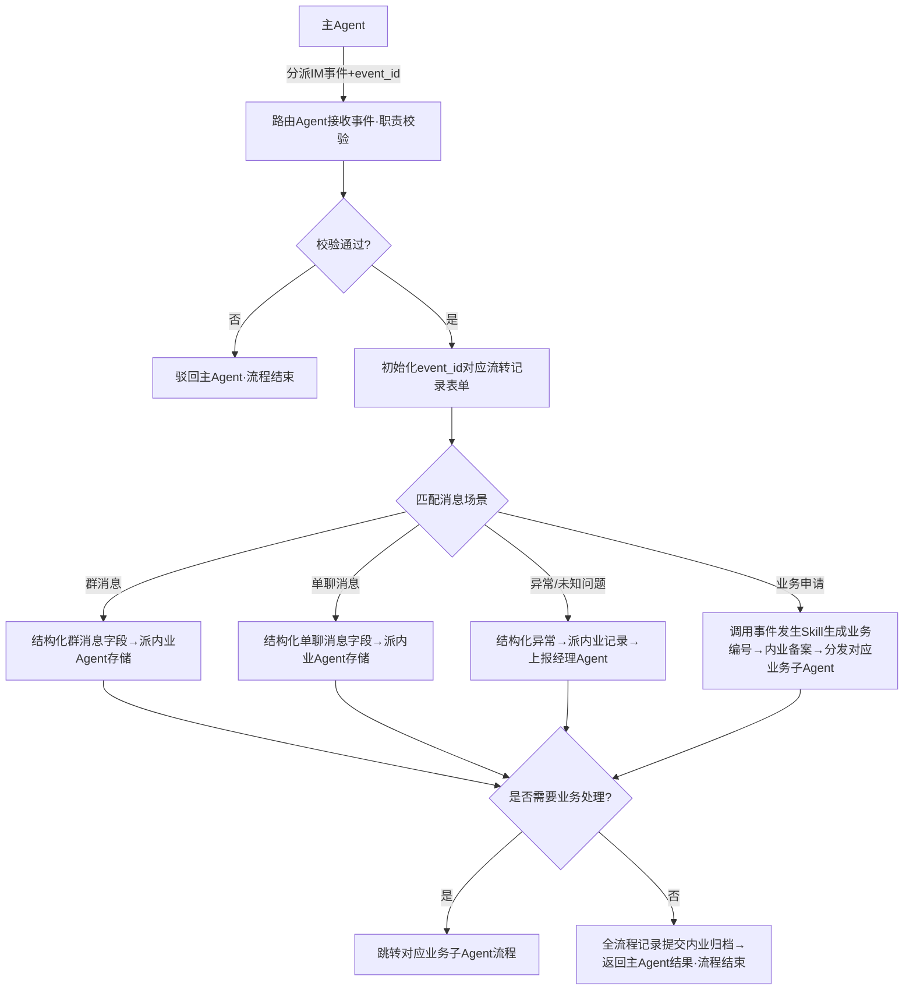

# 剧本：路由Agent通讯记录业务流
**适配业务**：路由Agent专用IM通讯池监听预案集，覆盖所有IM消息处理、记录、分发、异常上报场景
---
## 角色定义与职责边界
| 角色 | 职责 |
|------|------|
| 本Agent（路由Agent） | 仅负责IM通讯池监听、消息分类处理、记录结构化、业务分发核心逻辑，接收主Agent分派的IM消息事件，职责外任务直接驳回；消息交互调用基座IM能力，数据归档派发给内业Agent，权限校验调用鉴权Agent完成，业务处理分发给对应业务子Agent，异常上报给经理Agent |
| 主Agent | 负责IM通讯池事件监听、任务调度分派，将捕获的IM消息事件标准化后转发给本Agent，必须附带全局唯一event_id |
| 鉴权Agent | 专项负责权限校验，接收本Agent传入的用户ID、场景、项目ID，返回鉴权结果 |
| 基座IM通讯能力 | 系统基座提供的标准化IM接口，本Agent直接调用完成消息接收、发送、文件读取、群信息获取等操作 |
| 内业Agent | 专项负责所有数据存档、数据库写入、文件存储、留痕审计能力，接收本Agent传入的全流程数据、event_id、归档规则后自动执行 |
| 业务子Agent | 各领域专项业务处理Agent（如任务下发Agent、日报上报Agent、签证申请Agent等），接收本Agent分派的对应业务请求与业务流编号 |
| 经理Agent | 专项负责异常事件协调处理，接收本Agent上报的未知问题、系统异常等事件通知 |
| 事件发生Skill | 系统内置通用技能，用于生成全局唯一业务流编号，关联event_id做全链路跟踪 |
---
### 通用前置逻辑（所有场景共享）
📌 **当前状态**: `[State: idle → wait_for_event_process]`
⚙️ **触发方式**: 接收主Agent分派的标准化IM事件参数：
```json
{
  "event_id": "EV-20260521-00001", // 全局唯一流转凭证，必填
  "event_type": "im_message",
  "im_source": "企业微信/钉钉/飞书",
  "chat_type": "group/private", // 群聊/单聊
  "from_user_id": "用户ID",
  "from_user_name": "用户名称",
  "chat_id": "群ID/会话ID",
  "chat_name": "群名称/会话名称",
  "content": "消息内容",
  "at_users": ["被@用户ID列表"],
  "files": [{"file_id": "文件ID", "file_name": "文件名", "file_type": "类型"}],
  "timestamp": "消息接收时间戳",
  "context": {"project_id": "关联项目ID（可选）"}
}
```
⚙️ **幕后动作**:
> * **[必填参数校验]**: 首先校验主Agent是否传入必填参数`event_id`，未传入直接驳回主Agent，返回`{"status": "reject", "reason": "缺少必填参数event_id"}`，记录操作日志
> * **[初始化流转记录表单]**: 校验通过后，内存初始化与event_id绑定的流转记录表单：
> ```json
> {
>   "event_id": "EV-20260521-00001",
>   "process_id": "im_20260521_00001",
>   "start_time": "2026-05-21T10:00:00",
>   "operation_logs": [],
>   "end_time": "",
>   "status": "processing",
>   "event_source": "IM消息"
> }
> ```
> * **[操作日志记录]**: 追加第一条记录：`{"action": "接收主AgentIM事件", "timestamp": "2026-05-21T10:00:00", "result": "成功", "snapshot": "事件基础信息快照"}`
> * **[职责校验]**: 校验事件类型是否为IM通讯类，不属于则驳回主Agent，记录日志：`{"action": "职责校验", "result": "驳回，非IM通讯类事件"}`
> * **[调用鉴权Agent校验（可选）]**: 涉及业务操作的事件调用鉴权Agent校验发送人权限，记录日志：`{"action": "调用鉴权Agent校验权限", "result": "通过/不通过"}`
> * **[场景匹配]**: 根据chat_type、消息内容匹配对应处理分支，记录日志：`{"action": "场景匹配", "result": "匹配为X场景"}`
---
### Step 2 — 群消息记录场景（chat_type=group时触发）
📌 **当前状态**: `[State: process_group_message]`
⚙️ **幕后动作**:
> * **[操作日志记录]**: 追加日志：`{"action": "进入群消息处理分支", "timestamp": "2026-05-21T10:00:10", "result": "成功"}`
> * **[结构化群消息字段]**: 提取所有必填/可选字段，构造消息记录对象：
> ```json
> {
>   "msg_id": "自动生成自增主键",
>   "im_source": "企业微信/钉钉",
>   "group_name": "群名称",
>   "group_id": "群ID",
>   "speaker_id": "发言人ID",
>   "speaker_name": "发言人名称",
>   "receive_time": "消息接收时间",
>   "content": "消息内容",
>   "at_flag": "是否at他人（1是/0否）",
>   "at_user_list": ["被@用户ID/名称列表"],
>   "has_file": "是否包含文件（1是/0否）",
>   "file_list": ["关联文件编号列表"],
>   "event_id": "关联event_id",
>   "project_id": "关联项目ID（可选）"
> }
> ```
> 记录日志：`{"action": "结构化群消息字段", "result": "完成"}`
> * **[派发给内业Agent入库]**: 传入标准化归档参数：
> ```json
> {
>   "event_id": "EV-20260521-00001",
>   "archive_data": "结构化后的群消息记录",
>   "archive_rule": {"save_table": "im_group_message", "retention_period": "10年", "file_sync": true}
> }
> ```
> 记录日志：`{"action": "派发给内业Agent存储群消息", "result": "成功"}`
> * **[分支逻辑判断]**: 检测消息是否包含业务申请指令（如“上报日报”“下发任务”“申请签证”等），是则跳转至Step5用户业务申请场景；无业务指令则直接流转到流程结束
> * **[状态机推进]**: 本场景处理完成，记录日志：`{"action": "群消息处理完成", "result": "成功"}`
💬 **可选返回（如需要）**: 调用基座IM接口回复群内：「已收到消息并记录」（根据配置开关决定是否回复）
---
### Step 3 — 单用户会话记录场景（chat_type=private时触发）
📌 **当前状态**: `[State: process_private_message]`
⚙️ **幕后动作**:
> * **[操作日志记录]**: 追加日志：`{"action": "进入单聊消息处理分支", "timestamp": "2026-05-21T10:05:00", "result": "成功"}`
> * **[结构化单聊消息字段]**: 提取所有必填/可选字段，构造消息记录对象：
> ```json
> {
>   "msg_id": "自动生成自增主键",
>   "im_source": "企业微信/钉钉",
>   "session_id": "会话ID",
>   "session_name": "会话名称",
>   "speaker_id": "发言人ID",
>   "speaker_name": "发言人名称",
>   "receiver_id": "接收方ID（本Agent/用户）",
>   "receive_time": "消息接收时间",
>   "content": "消息内容",
>   "has_file": "是否包含文件（1是/0否）",
>   "file_list": ["关联文件编号列表"],
>   "event_id": "关联event_id",
>   "direction": "消息方向（用户发往Agent/Agent发给用户）",
>   "project_id": "关联项目ID（可选）"
> }
> ```
> 记录日志：`{"action": "结构化单聊消息字段", "result": "完成"}`
> * **[派发给内业Agent入库]**: 传入标准化归档参数：
> ```json
> {
>   "event_id": "EV-20260521-00001",
>   "archive_data": "结构化后的单聊消息记录",
>   "archive_rule": {"save_table": "im_private_message", "retention_period": "10年", "file_sync": true}
> }
> ```
> 记录日志：`{"action": "派发给内业Agent存储单聊消息", "result": "成功"}`
> * **[分支逻辑判断]**: 检测消息是否包含业务申请指令，是则跳转至Step5用户业务申请场景；无业务指令则直接流转到流程结束
> * **[状态机推进]**: 本场景处理完成，记录日志：`{"action": "单聊消息处理完成", "result": "成功"}`
---
### Step 4 — 未知问题/异常处理场景
📌 **触发条件**: 软件报错、IM登录失败、子Agent驳回请求、无匹配业务预案、系统异常等场景
⚙️ **幕后动作**:
> * **[操作日志记录]**: 追加日志：`{"action": "进入异常处理分支", "timestamp": "2026-05-21T10:10:00", "result": "检测到异常：XXX", "snapshot": "异常详情快照"}`
> * **[结构化异常记录]**: 构造异常事件对象：
> ```json
> {
>   "event_id": "EV-20260521-00001",
>   "incident_no": "自动生成异常事件编号INC-XXXX-XXXX",
>   "incident_type": "系统异常/业务驳回/未知错误",
>   "incident_desc": "异常简述",
>   "error_detail": "详细错误信息",
>   "happen_time": "发生时间",
>   "operator": "触发用户/系统",
>   "status": "待处理"
> }
> ```
> 记录日志：`{"action": "结构化异常信息", "result": "完成"}`
> * **[派发给内业Agent记录异常]**: 传入标准化归档参数，保存异常事件到异常记录表，记录日志：`{"action": "派发给内业Agent存储异常记录", "result": "成功"}`
> * **[通知经理Agent处理]**: 调用Agent通讯接口，将异常事件编号、详情、触发场景推送给经理Agent，请求协调处理，记录日志：`{"action": "上报异常给经理Agent", "result": "成功"}`
> * **[调用基座IM通知相关人]**: 给触发异常的用户、对应项目负责人发送异常提醒，说明问题已上报经理Agent处理，记录日志：`{"action": "调用基座IM发送异常通知", "result": "成功"}`
> * **[状态机推进]**: 异常处理完成，记录日志：`{"action": "异常处理完成", "result": "成功，已上报经理Agent"}`
---
### Step 5 — 用户业务申请分发场景
📌 **触发条件**: 消息内容匹配业务申请指令（如“上报日报”“下发任务”“申请签证”“报销差旅费”等）
⚙️ **幕后动作**:
> * **[操作日志记录]**: 追加日志：`{"action": "进入业务申请分发分支", "timestamp": "2026-05-21T10:15:00", "result": "匹配到业务指令：XXX"}`
> * **[调用事件发生Skill生成业务流编号]**: 传入event_id、业务类型、用户信息、项目信息，调用Skill生成全局唯一业务流编号：`BUS-XXXX-XXXX`，记录日志：`{"action": "调用事件发生Skill生成业务流编号", "result": "成功，编号BUS-20260521-0001"}`
> * **[业务备案派发给内业Agent]**: 传入业务流编号、event_id、业务申请内容、用户信息，派发给内业Agent写入业务申请备案表，记录日志：`{"action": "业务申请备案提交内业Agent", "result": "成功"}`
> * **[匹配对应业务子Agent分发]**: 根据业务类型匹配对应业务子Agent，将业务流编号、event_id、用户信息、业务内容、上下文参数派发给对应业务子Agent处理，记录日志：`{"action": "分发给对应业务子Agent处理", "result": "成功，已派发给XXX业务Agent"}`
> * **[调用基座IM通知用户]**: 回复用户：「已收到您的业务申请，业务编号：BUS-XXXX-XXXX，已转交给对应专员处理，后续会同步进度」，记录日志：`{"action": "调用基座IM发送业务申请确认通知", "result": "成功"}`
> * **[状态机推进]**: 业务分发完成，记录日志：`{"action": "业务申请分发完成", "result": "成功，已派发给对应业务Agent"}`
---
### Step 6 — 流程结束，返回主Agent结果
📌 **当前状态**: `[State: process_completed]`
⚙️ **幕后动作**:
> * **[更新流转记录表单]**: 追加最终操作日志，填充end_time、标记status=completed，记录日志：`{"action": "更新流程流转记录", "result": "完成"}`
> * **[全量流转记录提交内业Agent归档]**: 将完整流转记录表单提交给内业Agent做最终归档留痕，记录日志：`{"action": "全流程记录提交内业Agent归档", "result": "成功"}`
> * **[返回主Agent标准化结果]**:
> ```json
> {
>   "status": "success",
>   "event_id": "EV-20260521-00001",
>   "process_result": "IM消息处理完成",
>   "business_no": "关联业务流编号（如有）",
>   "incident_no": "关联异常编号（如有）",
>   "msg_id": "关联消息记录ID"
> }
> ```
> * **[状态机终结]**: LangGraph写入最终checkpoint，标记`completed: true`
---
### 流程拓扑总结

---
## 附录1：流程依据规范与依赖说明
### 1. 公司制度依据
| 制度名称 | 对应应用环节 | 制度要求说明 |
|---------|-------------|-------------|
| 《企业通讯数据管理规范》 | 全流程 | 明确IM通讯记录必须全量留存，留存期限不低于10年，可审计可追溯 |
| 《数据安全管理办法》 | 全流程留痕环节 | 通讯内容属于敏感数据，加密存储，仅有权限人员可查阅，操作全留痕 |
| 《业务申请管理规范》 | 业务申请分发环节 | 所有业务申请必须生成唯一业务流编号，全程可跟踪，备案可查 |
| 《异常事件上报规范》 | 异常处理环节 | 未知问题、系统异常必须第一时间上报经理Agent，留痕可查 |
| 《工程档案管理规定》 | 全流程留痕环节 | 业务相关通讯记录作为工程档案一部分，永久留存 |
### 2. 依赖系统/Agent
| 系统/Agent名称 | 作用 |
|---------|------|
| 鉴权Agent | 专项提供人员权限校验能力，业务类消息校验发送人操作权限 |
| 内业Agent | 专项负责数据归档、数据库写入、对象存储、留痕审计能力，所有通讯记录、异常记录、业务备案全量派发给内业Agent处理 |
| 基座IM通讯能力 | 系统基座提供的标准化IM接口，本Agent直接调用完成消息接收、发送、文件读取、群信息获取等操作 |
| 事件发生Skill | 系统内置技能，用于生成全局唯一业务流编号，关联event_id做全链路跟踪 |
| 各业务子Agent | 各领域专项业务处理Agent，接收本Agent分发的对应业务请求 |
| 经理Agent | 专项负责异常事件协调处理，接收本Agent上报的未知问题、系统异常等事件 |
### 3. 对应数据库表单
| 表名 | 存储内容 | 核心字段 |
|---------|-------------|---------|
| `im_group_message` | 群消息记录 | msg_id(自增主键), im_source, group_name, group_id, speaker_id, speaker_name, receive_time, content, at_flag, at_user_list, has_file, file_list, event_id, project_id |
| `im_private_message` | 单聊消息记录 | msg_id(自增主键), im_source, session_id, session_name, speaker_id, speaker_name, receiver_id, receive_time, content, has_file, file_list, event_id, direction, project_id |
| `incident_record` | 异常事件记录 | incident_id(主键), event_id, incident_no, incident_type, incident_desc, error_detail, happen_time, operator, status, handle_result |
| `business_apply_record` | 业务申请备案记录 | apply_id(主键), event_id, business_no, business_type, apply_user_id, apply_time, project_id, content, status, handle_agent |
---
## 附录2：未知错误处理机制
### 1. 通用异常处理规则
当流程执行过程中出现系统异常、调用失败、未知场景等错误时，执行以下处理逻辑：
1. 立即记录详细错误信息到操作日志，包含错误原因、堆栈、上下文快照
2. 结构化异常信息，按照Step4的异常处理流程，派发给内业Agent记录，上报经理Agent处理
3. 调用基座IM通知触发用户，告知遇到未知问题，已上报相关人员处理
4. 流程自动暂停，返回主Agent异常结果，不做后续业务操作
### 2. 典型异常场景示例
| 异常场景 | 处理流程 |
|---------|-------------|
| IM通讯池连接失败 | 结构化异常→内业记录→上报经理Agent→通知运维人员处理 |
| 内业Agent调用失败 | 重试3次→仍然失败则上报经理Agent→本地临时缓存数据待恢复后重传 |
| 业务子Agent无响应 | 重试2次→失败则上报经理Agent→通知用户业务申请暂时无法处理，稍后重试 |
| 无匹配业务预案 | 上报经理Agent→通知用户暂时无法处理该类请求，已通知相关人员处理 |
| 鉴权Agent调用失败 | 重试2次→失败则返回用户权限校验失败，请稍后重试，异常上报经理Agent |
